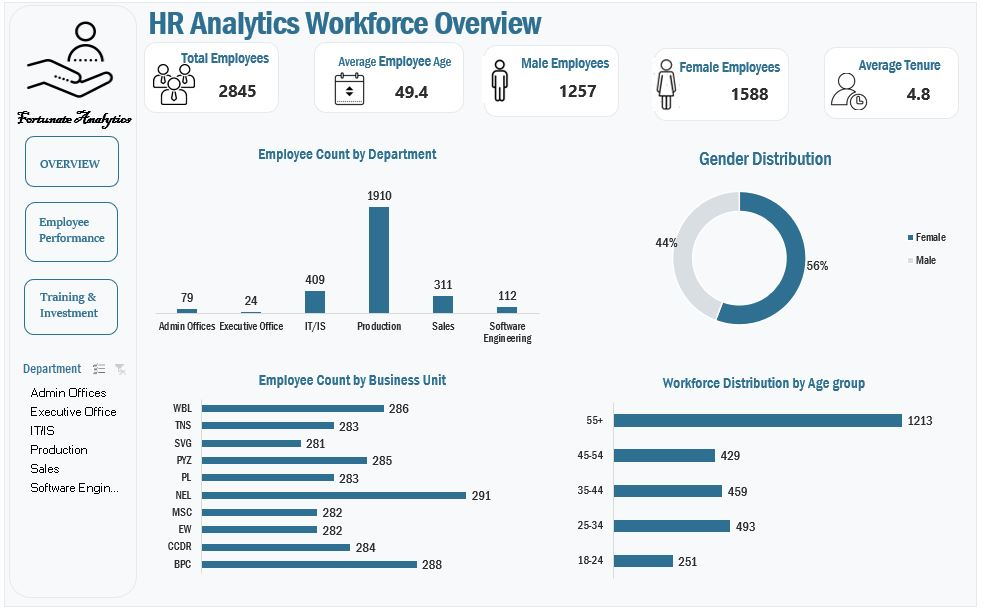
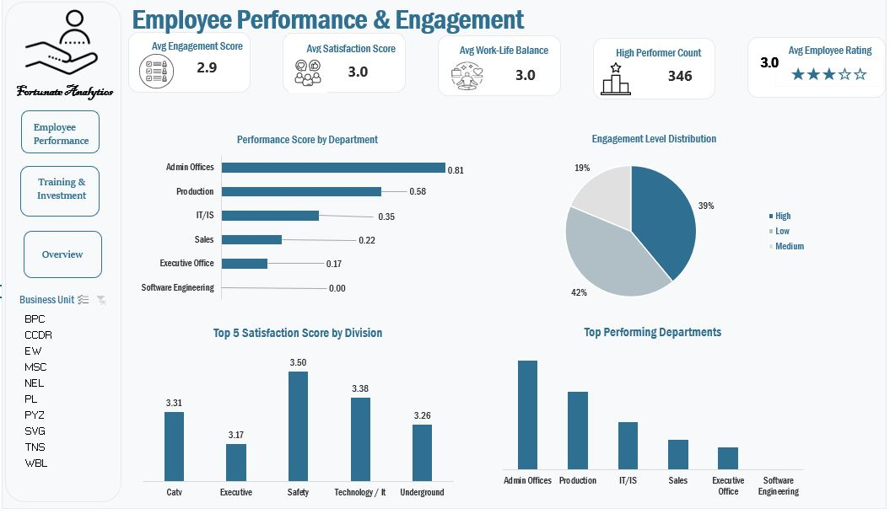
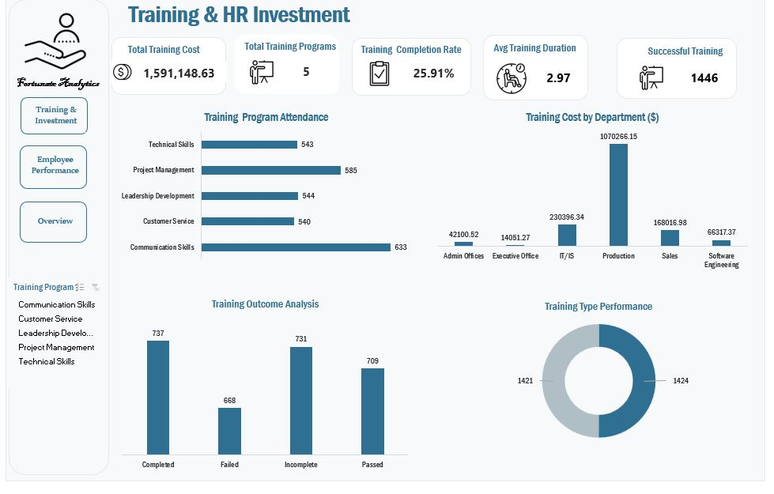

# HR Analytics Dashboard

**Tool:** Microsoft Excel | **Data:** 2,845 Employees · 28 Fields  
**Dashboards:** Workforce Overview · Employee Performance & Engagement · Training & HR Investment




---

## Project Summary

This project analyzes HR data for a mid-to-large organization across three dimensions: workforce composition, employee performance and engagement, and training investment. The goal was to transform a raw HR dataset into an interactive, decision-ready Excel dashboard suite that an HR manager or business leader could use to identify risks, allocate training budgets, and understand workforce trends.

The entire pipeline — from raw data to final dashboard — was built in Excel using Power Query for cleaning, PivotTables with the Data Model for analysis, and slicers for interactivity.

---

## Dashboards

### 1. HR Analytics Workforce Overview
Headcount by department and business unit, gender distribution, age group breakdown, and average tenure. Sliceable by department.

### 2. Employee Performance & Engagement
KPI cards for avg engagement (2.9), satisfaction (3.0), work-life balance (3.0), and employee rating (3.0). Includes performance score by department, engagement level distribution, top satisfaction scores by division, and top performing departments. Sliceable by business unit.

### 3. Training & HR Investment
Total training spend ($1.59M), program attendance, training outcome analysis, cost by department, and internal vs. external training breakdown. Sliceable by training program.

---

## Key Insights

### Workforce
- The organization employs **2,845 people** with a **13.6% overall attrition rate** (387 terminated)
- **Production is the dominant department** at 1,910 employees (67.1% of headcount), making it the highest-cost department for training spend at $1.07M — over 4× the next closest department
- The **workforce skews older**: the 55+ age group is the largest cohort at 1,213 employees (42.6%), which has significant succession planning implications
- **Gender distribution is 56% Female / 44% Male** — relatively balanced across the organization
- The workforce is almost evenly split between Full-Time (35%), Contract (33.4%), and Part-Time (31.5%), suggesting a highly flexible, contingent workforce model

### Attrition Risk
- **Software Engineering has the highest attrition rate at 17.9%**, followed closely by Production at 16.9% — both are significantly above the company average
- **IT/IS attrition is 8.3%** — below average but worth monitoring given the department's technical criticality
- **Admin Offices and Sales have the lowest attrition** at 1.3% and 3.2% respectively
- Attrition is relatively uniform across age groups (13–15%), meaning the organization is not losing disproportionately more young or senior staff

### Performance & Engagement
- **79.1% of employees "Fully Meet" expectations**, with only 12.2% exceeding — suggesting a performance culture that rewards meeting standards rather than pushing above them
- **8.7% of employees are on Needs Improvement or PIP**, which represents ~248 employees — a meaningful operational risk especially concentrated in Production
- **Admin Offices lead departmental performance** (avg score 3.08) while Executive Office scores lowest (2.58), which is a notable finding worth investigating
- Engagement scores are consistently flat across all performance levels (2.86–2.96), indicating that **engagement is not meaningfully differentiating high from low performers** — this could point to measurement issues or systemic engagement challenges
- Average scores across Engagement, Satisfaction, Work-Life Balance, and Rating all cluster tightly around **3.0 out of 5** — consistently mediocre, suggesting organization-wide morale challenges rather than isolated pockets

### Training & HR Investment
- The organization spent **$1,591,148.63 on training** across 2,845 sessions at an average of **$559 per session**
- **Only 50.8% of training results in a successful outcome** (Passed + Completed). Nearly 1 in 4 sessions Failed, and another 1 in 4 were left Incomplete — meaning roughly **$785K of training spend may not be delivering value**
- **Communication Skills has the best success rate at 54.3%**, while **Technical Skills has the worst at 45.1%** — yet Technical Skills is being delivered to 543 employees. This is the highest-risk program and warrants a curriculum review
- **Project Management also underperforms at 47.7%** success rate despite being the second most attended program (585 participants, $329K spend)
- Internal and external training are nearly evenly split (1,421 vs. 1,424), suggesting no strong organizational preference — but outcome rates by delivery type are not yet compared in the dashboard (a gap worth adding)
- **Production absorbs 67.3% of total training budget** ($1.07M) proportional to its headcount, but given its 16.9% attrition rate, the ROI on this spend is questionable

---

## Recommendations

1. **Audit Technical Skills and Project Management programs** — with sub-50% success rates and high enrollment, these represent the biggest efficiency gap in the training budget
2. **Investigate Software Engineering attrition** — at 17.9% this is the highest in the company and likely expensive to sustain given hiring costs for technical talent
3. **Address the 55+ succession gap** — with 42.6% of employees over 55, the organization needs a visible knowledge transfer and succession pipeline, especially in Production
4. **Rethink the engagement strategy** — scores hovering at 3.0 uniformly across all performance groups suggest engagement initiatives aren't differentiating. A targeted intervention for high performers may be needed to retain them
5. **Track training ROI by department** — Production spends the most on training but has the second-highest attrition. Connecting training outcomes to retention and performance scores would sharpen budget decisions

---

## Tools & Techniques

| Tool | Application |
|---|---|
| Power Query | Data cleaning — removed `$` and `,` from currency fields, stripped CHAR(160) hidden spaces, fixed date serial numbers, trimmed trailing whitespace in department names |
| PivotTables + Data Model | Enabled Distinct Count; built all KPI aggregations |
| Excel Formulas | `SUMPRODUCT`, `COUNTIFS`, `VALUE`, `TRIM`, `SUBSTITUTE`, `CHAR` for calculated fields |
| Slicers | Interactive filtering by Department, Business Unit, Training Program |
| Charts | Bar, horizontal bar, donut, and column charts across all three dashboards |
| KPI Cards | Custom icon + value cards for headline metrics on each dashboard |

---

## Dataset

| | |
|---|---|
| File | HR_Analytics.xlsx |
| Rows | 2,845 employee records |
| Columns | 28 fields |
| Sheets | HR Data · Cleaned Data · 3 analysis sheets · 3 dashboard sheets |

**Fields include:** Employee ID, Start Date, Title, Business Unit, Employee Status, Employee Type, Pay Zone, Department, Division, DOB, State, Gender, Race, Marital Status, Performance Score, Employee Rating, Engagement Score, Satisfaction Score, Work-Life Balance Score, Training Program, Training Type, Training Outcome, Training Duration, Training Cost, Age

---

## File Structure

```
HR_Analytics.xlsx
├── HR Data                        → Raw source data (2,845 rows × 28 cols)
├── Cleaned Data                   → Power Query output, standardized types
├── Workforce Overview             → Pivot analysis: headcount & demographics  
├── Employee Performance           → Pivot analysis: scores & engagement
├── Training & HR Investment       → Pivot analysis: spend & outcomes
├── Workforce Overview Dashboard   → Interactive dashboard with slicers
├── Employee Performance Dash      → Interactive dashboard with slicers
└── Training & HR Investment Dash  → Interactive dashboard with slicers
```
